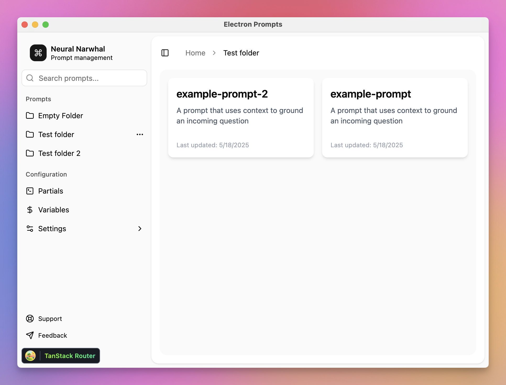

# electron-prompts

An Electron application with React and TypeScript



## Features

✨ **Prompt Management**
- Create, edit, delete, and duplicate prompts
- Full support for the [Prompty](https://prompty.ai) specification
- Real-time validation and syntax highlighting
- Version history with visual diff and restore

🧩 **Partials System**
- Include reusable partials in prompts (`{{>partial_name}}`)
- Global and folder-specific partials
- Automatic update of prompts when partials change

🔢 **Variables Management**
- Global and folder-level variables with override
- Variable substitution (`{{variable}}`) and environment support (`${env:VAR_NAME}`)
- UI for editing and validating variables

🗂️ **Categorization & Organization**
- Hierarchical folder structure
- Tags, custom attributes, and favorites/pinned prompts
- Drag-and-drop organization and batch operations

🔍 **Advanced Search**
- Full-text and fuzzy search across prompts and metadata
- Filtering by category, tags, and attributes
- Search result highlighting

📦 **Import/Export & Backup**
- Import/export in Prompty, plain text, or JSON
- Batch operations and local backup/restore

⚡ **Performance & UX**
- Instant search and smooth navigation for large libraries
- Keyboard shortcuts and workflow optimizations
- Customizable layout and theming (dark/light mode)

🔒 **Security & Privacy**
- Local storage with optional encryption
- Secure handling of API keys and sensitive data

♿ **Accessibility**
- Full keyboard navigation
- Screen reader support
- High contrast and adjustable text size

## Data Privacy & Local-First

🛡️ **Your data stays on your machine.**
- All prompts, settings, and variables are stored 100% locally on your computer.
- No data is ever sent to the cloud or any external server—privacy by design.
- You have full control: manage your prompt vaults with your favorite tools, including **git** for versioning, backup, and collaboration.

---

## Tech Stack
- ⚡ Electron (with Vite) for cross-platform desktop app
- ⚛️ React + TypeScript for UI
- 🧭 TanStack Router for navigation
- 🎨 TailwindCSS v4 & shadcn/ui for styling
- 🗄️ Local folder storage (Prompty spec)
- ⚙️ electron-store for settings

---

## License

This project is licensed under the [MIT License](./LICENSE).

## Recommended IDE Setup

- [VSCode](https://code.visualstudio.com/) + [ESLint](https://marketplace.visualstudio.com/items?itemName=dbaeumer.vscode-eslint) + [Prettier](https://marketplace.visualstudio.com/items?itemName=esbenp.prettier-vscode)

## Project Setup

### Install

```bash
$ pnpm install
```

### Development

```bash
$ pnpm dev
```

### Build

```bash
# For windows
$ pnpm build:win

# For macOS
$ pnpm build:mac

# For Linux
$ pnpm build:linux
```
